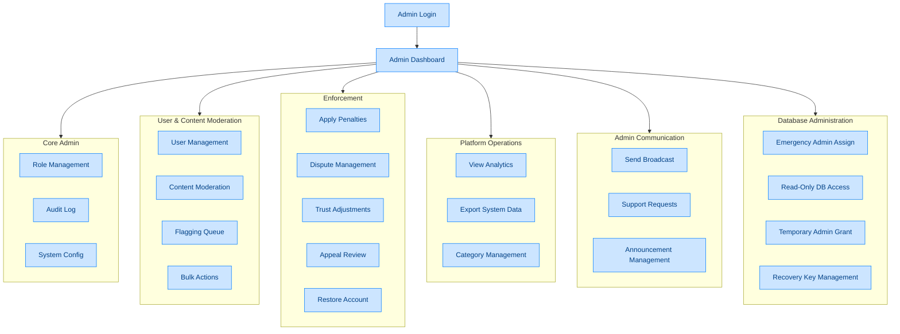

# Admin Flow

**Feature**: Admin Core System, Moderation, Enforcement, Operations, Communication, Database Administration
**Screens**: 12 (0 existing + 12 pending)
**Status**: Planned

## Diagram

## Flow Description
The admin panel provides full system management. Admins log in with elevated privileges and access a dashboard with KPIs. Core features include user management (view, suspend, delete), content moderation (queue, flag, bulk actions), dispute resolution, analytics, and system configuration. Communication tools allow broadcasting announcements. Database administration features handle emergency access, read-only analytics access, and recovery key management.

## Screen Inventory

| Screen | Route | Status | Use Cases |
|--------|-------|--------|-----------|
| Admin Login | `/admin/login` | ❌ Todo | A01 |
| Admin Dashboard | `/admin` | ❌ Todo | A02 |
| Role Management | `/admin/roles` | ❌ Todo | A03 |
| Audit Log | `/admin/audit` | ❌ Todo | A04 |
| User Management | `/admin/users` | ❌ Todo | A05 |
| Content Moderation | `/admin/moderation` | ❌ Todo | A06-A10 |
| Enforcement/Penalties | `/admin/penalties` | ❌ Todo | A11-A15 |
| Analytics | `/admin/analytics` | ❌ Todo | A16-A17 |
| System Config | `/admin/config` | ❌ Todo | A18 |
| Category Management | `/admin/categories` | ❌ Todo | A19 |
| Broadcast | `/admin/broadcast` | ❌ Todo | A20-A22 |
| Database Admin | `/admin/database` | ❌ Todo | A23-A26 |

## Notes
- Admin login requires role-based access control (RBAC)
- Audit log is immutable — all admin actions are recorded
- Penalties follow 3-strike rule: warning → suspension → permanent ban
- Emergency admin assignment uses multi-step verification
