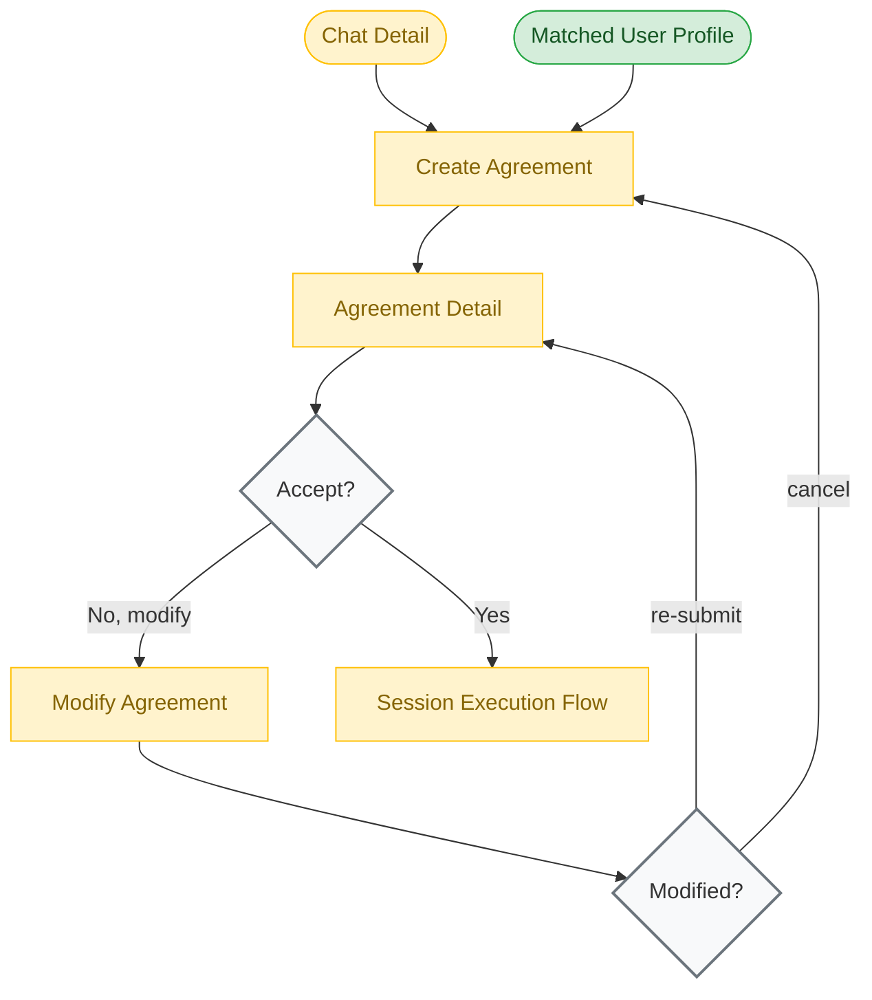

# Agreement Flow

**Feature**: Agreement System
**Screens**: 3 (0 existing + 3 pending)
**Status**: Planned

## Diagram

## Flow Description
After matching with a user, either party can propose a skill exchange agreement. The Create Agreement form captures the terms — what skills are being exchanged, duration, frequency, and format. The other party views the agreement and can accept, request modifications, or cancel. Once accepted, the flow proceeds to Session scheduling.

## Screen Inventory

| Screen | Route | Status | Use Cases |
|--------|-------|--------|-----------|
| Create Agreement | `/agreements/create` | ❌ Todo | C09 |
| Agreement Detail | `/agreements/:id` | ❌ Todo | C10, C12, C13 |
| Modify Agreement | `/agreements/:id/modify` | ❌ Todo | C11 |

## Notes
- Agreements are the bridge between matching and session execution
- Cancellation policy enforcement (cooldown periods, notifications) needs design consideration
- Version history of modifications should be tracked
