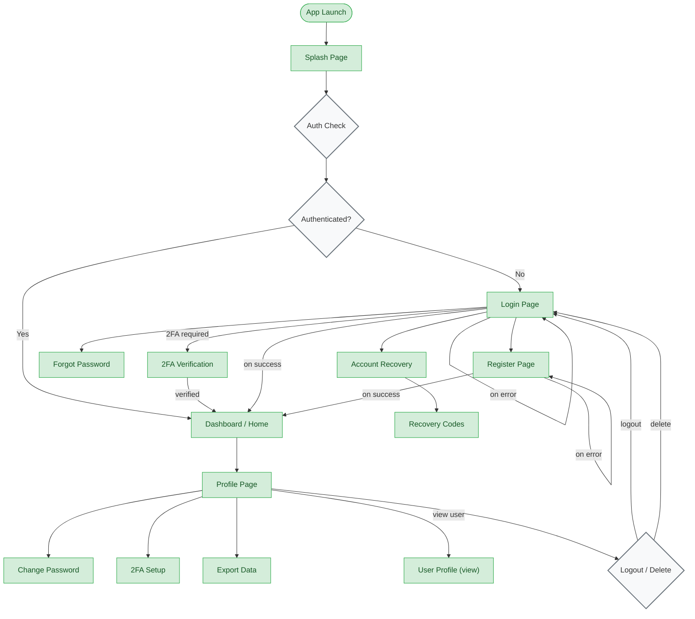

# Auth Flow

**Feature**: Authentication & Identity
**Screens**: 13 (13 existing + 0 pending)
**Status**: Complete

## Diagram

## Flow Description
On app launch, the Splash Page triggers an auth check. If the user has a valid session, they go directly to the Dashboard. If not, they land on the Login page. Login supports email/password authentication, with links to registration, password reset, and account recovery. After successful login, users with 2FA enabled must verify via TOTP before accessing the dashboard. The Profile page provides access to all authenticated settings.

## Screen Inventory

| Screen | Route | Status | Use Cases |
|--------|-------|--------|-----------|
| Splash Page | `/splash` | ✅ Existing | F01 |
| Login Page | `/login` | ✅ Existing | F03 |
| Register Page | `/register` | ✅ Existing | F02 |
| Forgot Password | `/forgot-password` | ✅ Existing | F08 |
| Account Recovery | `/account-recovery` | ✅ Existing | F09 |
| Recovery Codes | `/recovery-codes` | ✅ Existing | F09 |
| 2FA Setup | `/2fa-setup` | ✅ Existing | F10 |
| 2FA Verification | `/2fa-verify/:uid` | ✅ Existing | F10 |
| Dashboard / Home | `/home` | ✅ Existing | F06 |
| Profile Page | `/profile` | ✅ Existing | F11, F12, F13, F15 |
| User Profile | `/profile/:uid` | ✅ Existing | F14 |
| Change Password | `/change-password` | ✅ Existing | F08 |
| Export Data | `/export-data` | ✅ Existing | F16 |

## Notes
- Auth check happens via `AuthCheckRequested` event dispatched in `main.dart`
- Router guards: `AuthInitial`/`AuthLoading` = no redirect; `AuthUnauthenticated` = redirect to `/login`; `AuthAuthenticated` = allow
- Error states on login/register show snackbar messages and stay on the form
