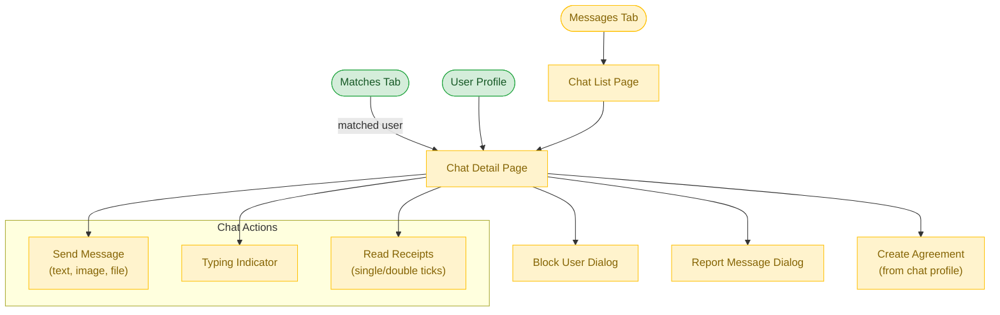

# Communication Flow

**Feature**: Messaging System
**Screens**: 2 (0 existing + 2 pending)
**Status**: Planned

## Diagram

## Flow Description
The Messages tab shows a list of active conversations. Tapping a conversation opens the Chat Detail Page with real-time messaging, typing indicators, and read receipts. Users can send text, images, and files. From a chat, users can block the other person or report inappropriate messages. After matching, users can initiate a chat or proceed to create a formal agreement.

## Screen Inventory

| Screen | Route | Status | Use Cases |
|--------|-------|--------|-----------|
| Chat List | `/chats` | ❌ Todo | C01, C04 |
| Chat Detail | `/chats/:id` | ❌ Todo | C02-C08 |

## Notes
- Requires real-time messaging via Firebase (FCM for push, Realtime Database for messages)
- Block user (C07) and report message (C08) are essential safety features
- Typing indicator and read receipts add polish for premium feel
