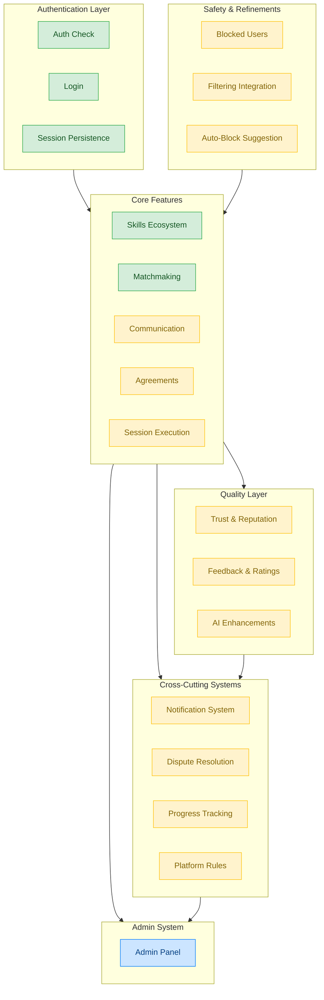

# Cross-Cutting Flow

**Feature**: System-Wide Integration
**Screens**: All
**Status**: Reference

## Diagram

## Flow Description
The app architecture follows a layered model. Authentication gates all core features. Skills and Matching feed into Communication, which leads to Agreements and Sessions. Completed Sessions trigger Feedback and Trust Score updates. AI enhances matching and recommendations. Cross-cutting systems (Notifications, Disputes, Progress) serve all features. Admin oversees everything.

## Data Flow Summary

| Trigger | Action | Downstream Effect |
|---------|--------|-------------------|
| User registers | Auth creates profile | Ready for skills & matching |
| User creates skill | Skill entity stored | Becomes discoverable in feed |
| Matches generated | Scoring algorithm runs | Cards shown in matchmaking |
| Match accepted | Status updated | Chat enabled, agreement possible |
| Agreement accepted | Terms locked | Session scheduling unlocked |
| Session completed | Rating triggered | Trust score updated, progress tracked |
| Negative behavior | Report/Dispute filed | Admin review, trust adjustment |

## Notes
- Auth guard applies to all routes except `/login`, `/register`, `/forgot-password`
- Notifications can be triggered from any feature (matches, messages, reminders)
- Trust score is a global metric affecting match ranking and discovery filtering
- Admin has oversight across all features via audit log
