# Dashboard Flow

**Feature**: Home / Navigation Shell
**Screens**: 1 (1 existing + 0 pending)
**Status**: Complete

## Diagram

```mermaid
flowchart TD
    classDef done fill:#d4edda,stroke:#28a745,color:#155724
    classDef pending fill:#fff3cd,stroke:#ffc107,color:#856404
    classDef admin fill:#cce5ff,stroke:#007bff,color:#004085

    HomePage(["Dashboard / Home"]):::done

    subgraph BottomNav["Bottom Navigation (IndexedStack)"]
        ExploreTab["Explore Tab"]:::done
        MatchesTab["Matches Tab"]:::done
        MessagesTab["Messages Tab"]:::done
        ProfileTab["Profile Tab"]:::done
    end

    ExploreTab --> OfferSkill["Offer Skill\n/skills/create"]:::done
    ExploreTab --> LearnSkill["Learn Skill\n/skills/create-request"]:::done
    ExploreTab --> BrowseFeed["Browse Feed\n/skills/feed"]:::done
    ExploreTab --> SearchSkills["Search Skills\n/skills/search"]:::done
    ExploreTab --> MatchHistory["Match History\n/matches/history/:uid"]:::done
    ExploreTab --> FilterSkills["Filter Skills\n/skills/filter"]:::done
    ExploreTab --> SavedSearches["Saved Searches\n/skills/saved-searches/:uid"]:::done

    MatchesTab --> Matchmaking["Matchmaking Page\n/matches"]:::done
    MessagesTab --> ChatPlaceholder["Chat List\n(placeholder)"]:::done

    ProfileTab --> ChangePassword["Change Password\n/change-password"]:::done
    ProfileTab --> TwoFA["2FA Setup\n/2fa-setup"]:::done
    ProfileTab --> ExpData["Export Data\n/export-data"]:::done
    ProfileTab --> ProfileMatchHistory["Match History\n/matches/history/:uid"]:::done
    ProfileTab --> AcctRecovery["Account Recovery\n/account-recovery"]:::done
    ProfileTab --> Logout["Logout / Delete"]:::done

    HomePage --> BottomNav
```

## Flow Description
The Dashboard is the central navigation hub. It uses a `BottomNavigationBar` with 4 tabs managed by `IndexedStack` — Explore, Matches, Messages, and Profile. Each tab is a separate widget within `home_page.dart`. The Explore tab provides quick actions to create skills, browse the feed, search, and access settings. The Messages tab is currently a placeholder waiting for chat implementation.

## Screen Inventory

| Screen | Route | Status | Use Cases |
|--------|-------|--------|-----------|
| Home/Dashboard | `/home` | ✅ Existing | F06, X09 |

## Notes
- Bottom nav uses `IndexedStack` so all tabs stay alive in memory
- Nested Scaffolds: HomePage wraps content in a Scaffold, each tab also has its own Scaffold
- Messages tab shows a premium empty state with CTA to find matches
- Profile tab shows gradient header with user avatar, name, email, stats, and menu items
