# Data Entity Relationship Diagram

**Coverage**: Auth, Skills, Matchmaking, Communication, Agreement, Session, Trust, Notification, Dispute, Progress, Safety, Admin domains
**Storage**: Firebase Realtime Database (NoSQL)
**Naming**: `camelCase` fields, ISO 8601 timestamps, push IDs for list items

## Legend

```
PK  = Primary Key (partition key in RTDB)
FK  = Foreign Key (reference to another entity's PK)
[]  = Array field
{}  = Map field
?   = Nullable
*   = Denormalized (copied for read performance)
```

---

## Domain Overview

```mermaid
erDiagram
    USER ||--o{ SKILL : "userId (FK) owns"
    USER ||--o{ SAVED_SEARCH : "userId (FK) owns"
    USER ||--o{ MATCH : "targetUserId (FK) is target"
    USER ||--o{ CHAT_THREAD : "participantIds (FK) includes"
    USER ||--o{ AGREEMENT : "initiatorId / partnerId (FK)"
    USER ||--o{ SESSION : "participantIds (FK) includes"
    USER ||--o{ REVIEW : "reviewerId / targetUserId (FK)"
    USER ||--o{ TRUST_APPEAL : "userId (FK)"
    USER ||--o{ NOTIFICATION : "userId (FK)"
    USER ||--o{ NOTIFICATION_PREFERENCE : "userId (FK)"
    USER ||--o{ DISPUTE : "initiatorId / respondentId (FK)"
    USER ||--o{ REPORT : "reporterId / reportedUserId (FK)"
    USER ||--o{ LEARNING_GOAL : "userId (FK)"
    USER ||--o{ ACHIEVEMENT : "userId (FK, via lookup)"
    USER ||--o{ BLOCKED_USER : "blockerId / blockedUserId (FK)"
    USER ||--o{ PENALTY : "userId (FK)"
    USER ||--o{ SUPPORT_TICKET : "userId (FK)"

    SKILL ||--o{ MATCH : "matchedSkillId / targetSkillId (FK)"
    SKILL ||--o{ AGREEMENT : "skillId (FK)"
    AGREEMENT ||--o{ SESSION : "agreementId (FK)"
    SESSION ||--o{ SESSION_MATERIAL : "sessionId (FK)"
    SESSION ||--o{ SESSION_NOTE : "sessionId (FK)"
    SESSION ||--o{ CHECK_IN : "sessionId (FK)"
    SESSION ||--o{ REVIEW : "sessionId (FK)"
    DISPUTE ||--o{ DISPUTE_MESSAGE : "disputeId (FK)"

    USER {
        string uid PK
        string email
        string firstName
        string lastName
        string title
        string photoURL
        string bio
        array skills
        array interests
        object location
        string phone
        bool profileComplete
        bool twoFactorEnabled
        string twoFactorPin
        double trustScore
        bool isVerified
        string role
        datetime createdAt
        datetime updatedAt
    }
    SKILL {
        string pushId PK
        string title
        string description
        string category
        enum type
        enum level
        enum format
        string userId FK
        array tags
        datetime createdAt
        datetime updatedAt
        datetime archivedAt
        bool isVerified
        array portfolioUrls
        double latitude
        double longitude
        array availability
    }
    MATCH {
        string compositeId PK
        string targetUserId FK
        string targetSkillId FK
        string matchedSkillId FK
        double score
        enum status
        datetime createdAt
        string targetUserName
        string targetSkillTitle
        string targetSkillCategory
        enum targetSkillLevel
        enum targetSkillFormat
        double targetTrustScore
        bool targetIsVerified
        double distance
        array targetAvailability
    }
    CHAT_THREAD {
        string pushId PK
        array participantIds FK
        string lastMessagePreview
        string lastMessageTimestamp
        string lastMessageSenderId
        map unreadCount "userId -> count"
        datetime createdAt
    }
    MESSAGE {
        string pushId PK
        string threadId FK
        string senderId FK
        string body
        string timestamp
        enum readStatus "delivered | read"
        string messageType "text | image | file"
    }
    AGREEMENT {
        string pushId PK
        string initiatorId FK
        string partnerId FK
        string skillId FK
        string skillName
        enum initiatorRole "teacher | learner"
        enum partnerRole "teacher | learner"
        int durationWeeks
        int sessionsPerWeek
        array preferredDays
        enum format
        string location
        string materialsNeeded
        string notes
        enum status
        datetime createdAt
        datetime updatedAt
    }
    SESSION {
        string pushId PK
        string agreementId FK
        array participantIds FK
        string skillName
        int sessionNumber
        date sessionDate
        string startTime
        string endTime
        string timezone
        enum format
        string location
        enum status
        datetime createdAt
    }
    CHECK_IN {
        string pushId PK
        string sessionId FK
        string userId FK
        enum method "qr | manual | location"
        string code
        datetime timestamp
        bool verified
    }
    SESSION_MATERIAL {
        string pushId PK
        string sessionId FK
        string uploaderId FK
        string fileName
        int fileSize
        string fileType
        string fileUrl
        int downloadCount
        datetime uploadedAt
    }
    SESSION_NOTE {
        string pushId PK
        string sessionId FK
        string content
        string lastEditedBy FK
        datetime lastEditedAt
        array collaboratorIds FK
    }
    REVIEW {
        string pushId PK
        string sessionId FK
        string reviewerId FK
        string targetUserId FK
        int starRating
        string reviewText
        datetime createdAt
        datetime updatedAt
        bool verified
    }
    TRUST_APPEAL {
        string pushId PK
        string userId FK
        double currentScore
        double previousScore
        string dropReason
        string sessionId FK
        string category
        string description
        array evidenceFiles
        enum status
        datetime createdAt
        datetime resolvedAt
    }
    NOTIFICATION {
        string pushId PK
        string userId FK
        enum type
        string title
        string body
        bool read
        string targetRoute
        datetime createdAt
    }
    NOTIFICATION_PREFERENCE {
        string userId PK
        bool pushEnabled
        bool emailEnabled
        map matchSettings "type -> bool"
        map messageSettings "type -> bool"
        map sessionSettings "type -> bool"
        map agreementSettings "type -> bool"
        map trustSettings "type -> bool"
        map systemSettings "type -> bool"
    }
    DISPUTE {
        string pushId PK
        string initiatorId FK
        string respondentId FK
        string sessionId FK
        string agreementId FK
        enum category
        string description
        string desiredOutcome
        enum status
        string adminId
        datetime createdAt
        datetime resolvedAt
    }
    DISPUTE_MESSAGE {
        string pushId PK
        string disputeId FK
        string senderId FK
        enum senderRole "user | admin | other"
        string body
        datetime createdAt
    }
    REPORT {
        string pushId PK
        string reporterId FK
        string reportedUserId FK
        enum category
        string description
        array attachments
        enum status
        datetime createdAt
    }
    LEARNING_GOAL {
        string pushId PK
        string userId FK
        string title
        string skillId FK
        int progressPercent
        date targetDate
        enum status
        datetime createdAt
        datetime completedAt
    }
    ACHIEVEMENT {
        string id PK
        string name
        string icon
        string description
        string unlockCriteria
        enum rarity
        string category
        int sortOrder
    }
    ACHIEVEMENT_UNLOCK {
        string pushId PK
        string userId FK
        string achievementId FK
        datetime unlockedAt
    }
    SKILL_PROGRESS {
        string pushId PK
        string userId FK
        string skillId FK
        int sessionsCompleted
        int totalSessions
        int progressPercent
        datetime lastSessionDate
    }
    BLOCKED_USER {
        string pushId PK
        string blockerId FK
        string blockedUserId FK
        datetime createdAt
    }
    PLATFORM_RULE {
        string id PK
        int version
        string content
        bool requiresAcknowledgment
        datetime publishedAt
    }
    USER_ACKNOWLEDGMENT {
        string pushId PK
        string userId FK
        string ruleId FK
        int ruleVersion
        datetime acknowledgedAt
    }
    SUPPORT_TICKET {
        string pushId PK
        string userId FK
        string subject
        string body
        enum priority
        enum status
        string assignedAdminId
        datetime createdAt
        datetime resolvedAt
    }
    LOCATION {
        string address
        double latitude
        double longitude
    }
```

---

## Auth / User Domain

**RTDB Path**: `users/{uid}`, `blockedUsers/{pushId}`

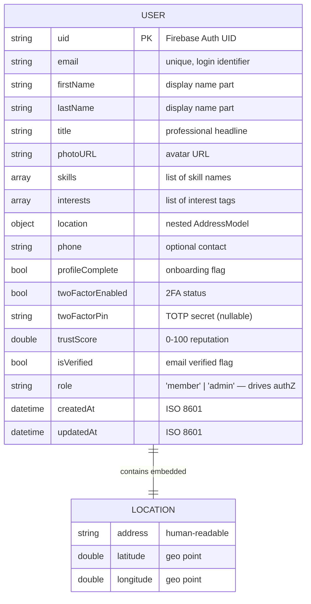

### Enums

| Field | Values |
|-------|--------|
| `role` | `member`, `admin` |

### Key Relationships

| FK Field | References | Type |
|----------|------------|------|
| `uid` | Firebase Auth `User.uid` | 1:1 |

### Usage Notes

- `UserRole.fromString()` normalizes case — always store lowercase
- `skills` and `interests` stored as flat string arrays for simplicity
- `location` is embedded, not a separate node (queried together with user)
- `twoFactorPin` stores the HMAC-based TOTP secret; null when 2FA is off
- `trustScore` updated by session completions, no-shows, and reviews
- Role-based access control uses the `role` field — gate checks via `userEntity.isAdmin`

---

## Skills Domain

**RTDB Paths**: `skills/{pushId}`, `savedSearches/{pushId}`

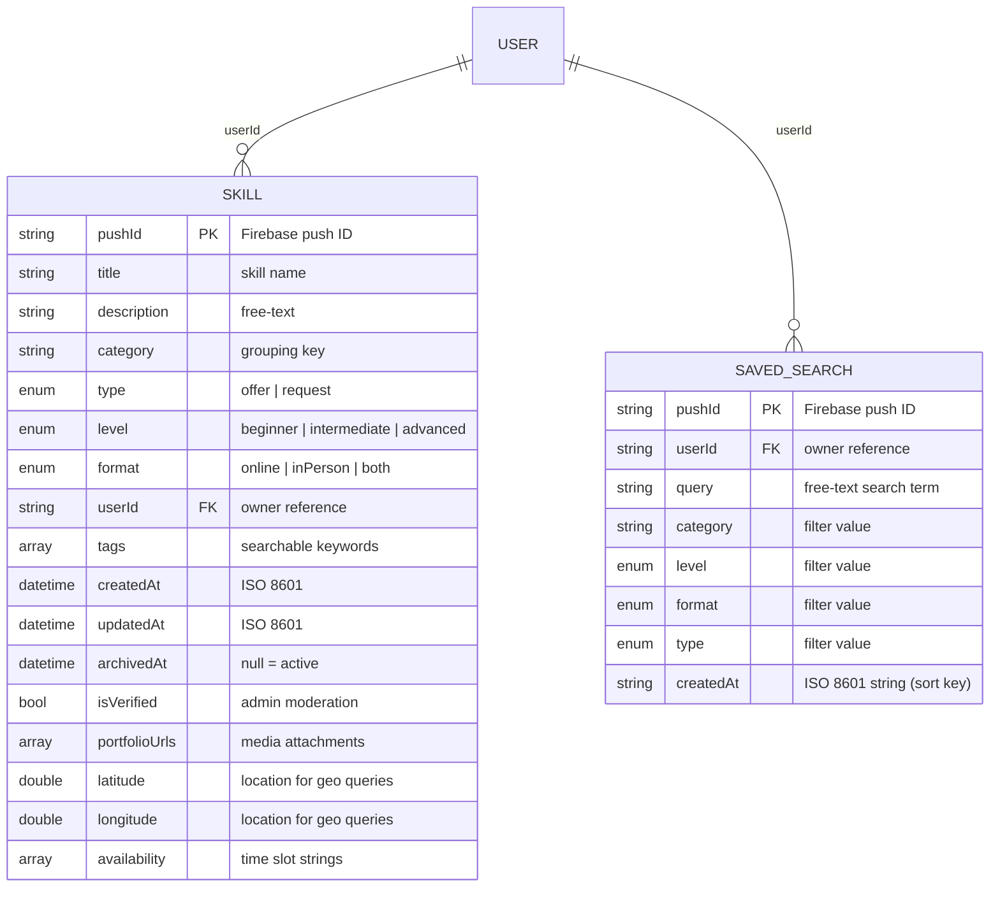

### Enums

| Field | Values |
|-------|--------|
| `type` | `offer`, `request` |
| `level` | `beginner`, `intermediate`, `advanced` |
| `format` | `online`, `inPerson`, `both` |

### Key Relationships

| FK Field | References | Type |
|----------|------------|------|
| `skill.userId` | `users/{uid}` | N:1 |
| `savedSearch.userId` | `users/{uid}` | N:1 |

### Usage Notes

- `archivedAt` is the soft-delete mechanism — null = active, non-null = archived
- `latitude`/`longitude` enable geo-proximity sorting in matchmaking
- `availability` values use `weekday_morning`, `weekday_afternoon`, `weekday_evening`, `weekend_morning`, `weekend_afternoon`
- `category` is a free-text grouping key (e.g. "Technology", "Music")

---

## Matchmaking Domain

**RTDB Path**: `matches/{compositeId}`

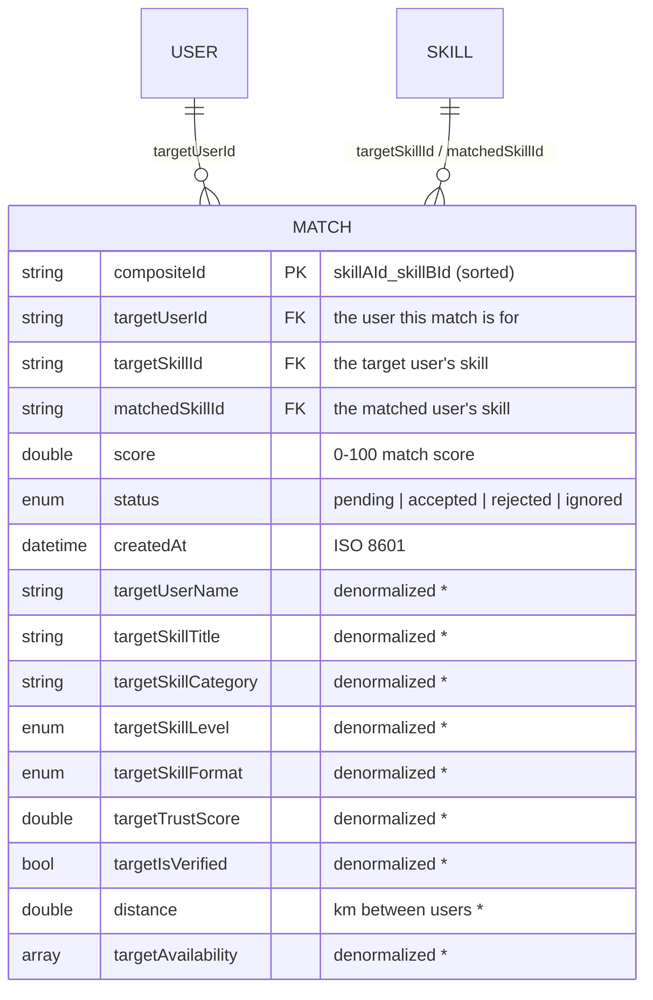

### Enums

| Field | Values |
|-------|--------|
| `status` | `pending`, `accepted`, `rejected`, `ignored` |

### Key Relationships

| FK Field | References | Type |
|----------|------------|------|
| `targetUserId` | `users/{uid}` | N:1 |
| `targetSkillId` | `skills/{pushId}` | N:1 |
| `matchedSkillId` | `skills/{pushId}` | N:1 |

### Usage Notes

- Matches are **denormalized** — user name, skill title, trust score copied at match-creation time so they remain readable even if the original profile changes
- The `compositeId` is `{matchedSkillId}_{targetSkillId}` (sorted alphabetically) to prevent duplicates
- Bidirectional: for each pair, two match records are created (one per direction)
- Score: category overlap (30pts) + level compatibility (25pts) + format match (20pts) + tag overlap (15pts) + geo-proximity (10pts) + availability overlap (5pts)

---

## Communication Domain

**RTDB Paths**: `chats/{pushId}`, `chats/{pushId}/messages/{pushId}`

**Status**: ❌ Not yet implemented

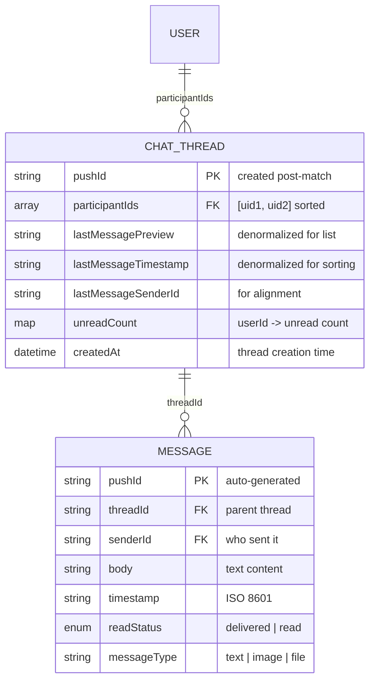

### Enums

| Field | Values |
|-------|--------|
| `readStatus` | `delivered`, `read` |
| `messageType` | `text`, `image`, `file` |

### Key Relationships

| FK Field | References | Type |
|----------|------------|------|
| `message.threadId` | `chats/{pushId}` | N:1 |
| `message.senderId` | `users/{uid}` | N:1 |

### Usage Notes

- Messages are stored as a **sub-collection** under the chat thread node for efficient pagination
- `lastMessagePreview/timestamp/senderId` are denormalized on the thread so the chat list screen can display without querying all messages
- `unreadCount` is a map keyed by userId so each participant can see their own unread count independently
- `readStatus` starts as `delivered` and transitions to `read` when the recipient opens the thread
- Threads created automatically when a match is accepted (C01)

---

## Agreement Domain

**RTDB Path**: `agreements/{pushId}`

**Status**: ❌ Not yet implemented

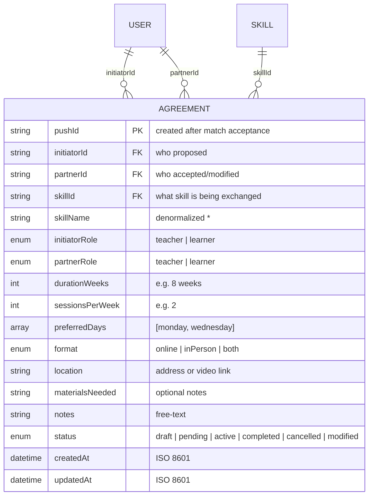

### Enums

| Field | Values |
|-------|--------|
| `initiatorRole` / `partnerRole` | `teacher`, `learner` |
| `format` | `online`, `inPerson`, `both` |
| `status` | `draft`, `pending`, `active`, `completed`, `cancelled`, `modified` |

### Key Relationships

| FK Field | References | Type |
|----------|------------|------|
| `initiatorId` | `users/{uid}` | N:1 |
| `partnerId` | `users/{uid}` | N:1 |
| `skillId` | `skills/{pushId}` | N:1 |

### Usage Notes

- `status` flows: `draft` → `pending` → `active` → `completed` (or `cancelled`)
- `modified` status triggers when a counter-proposal is accepted; the original is preserved for audit
- `skillName` is denormalized so agreement cards can display without a separate skill lookup
- Both `initiatorRole` and `partnerRole` are explicit so the agreement knows who teaches vs learns
- `preferredDays` stores weekday names for scheduling (e.g. `["monday", "wednesday"]`)

---

## Session Domain

**RTDB Paths**: `sessions/{pushId}`, `sessions/{pushId}/checkIns/{pushId}`, `sessions/{pushId}/materials/{pushId}`, `sessions/{pushId}/notes/{pushId}`, `skillProgress/{pushId}`

**Status**: ❌ Not yet implemented

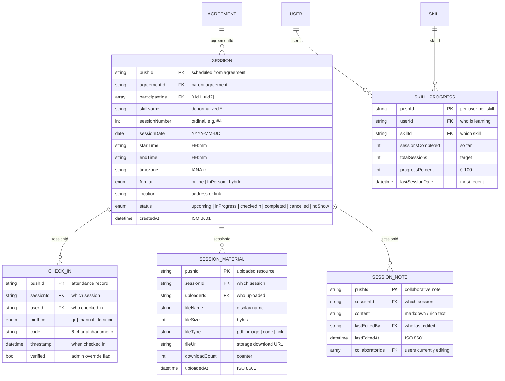

### Enums

| Field | Values |
|-------|--------|
| `status` | `upcoming`, `inProgress`, `checkedIn`, `completed`, `cancelled`, `noShow` |
| `format` | `online`, `inPerson`, `hybrid` |
| `checkIn.method` | `qr`, `manual`, `location` |

### Key Relationships

| FK Field | References | Type |
|----------|------------|------|
| `session.agreementId` | `agreements/{pushId}` | N:1 |
| `checkIn.sessionId` | `sessions/{pushId}` | N:1 |
| `material.sessionId` | `sessions/{pushId}` | N:1 |
| `note.sessionId` | `sessions/{pushId}` | N:1 |

### Usage Notes

- Sessions are scheduled from an agreement — one agreement produces many sessions
- `sessionNumber` is a human-readable ordinal (not a DB sequence) computed at creation
- Check-ins support three methods: QR scan, manual 6-char code, or geo-proximity
- Materials and notes are stored as **sub-collections** under the session node for lifecycle scoping
- `SkillProgress` tracks learning progress per-user per-skill, updated when sessions complete
- `participantIds` is a sorted 2-element array `[uid1, uid2]` for querying sessions by user

---

## Trust & Review Domain

**RTDB Paths**: `reviews/{pushId}`, `trustAppeals/{pushId}`

**Status**: ❌ Not yet implemented

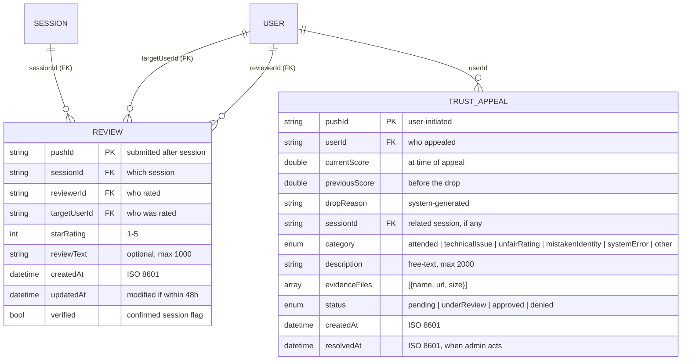

### Enums

| Field | Values |
|-------|--------|
| `starRating` | 1–5 |
| `appeal.category` | `attended`, `technicalIssue`, `unfairRating`, `mistakenIdentity`, `systemError`, `other` |
| `appeal.status` | `pending`, `underReview`, `approved`, `denied` |

### Key Relationships

| FK Field | References | Type |
|----------|------------|------|
| `review.sessionId` | `sessions/{pushId}` | N:1 |
| `review.reviewerId` | `users/{uid}` | N:1 |
| `review.targetUserId` | `users/{uid}` | N:1 |
| `appeal.sessionId` | `sessions/{pushId}` | N:1 |

### Usage Notes

- Reviews are created after a session completes; `verified=true` means the review is linked to a confirmed session
- Edit window is 48 hours from `createdAt` — enforced in the UI layer
- Trust score is computed from: session completion rate, average rating, behavior flags, review responsiveness, account age, and verification status
- An appeal is the user's mechanism to contest a trust score drop
- `evidenceFiles` stores metadata only; actual files go to Firebase Storage

---

## Notification Domain

**RTDB Paths**: `notifications/{userId}/{pushId}`, `notificationPreferences/{userId}`

**Status**: ❌ Not yet implemented

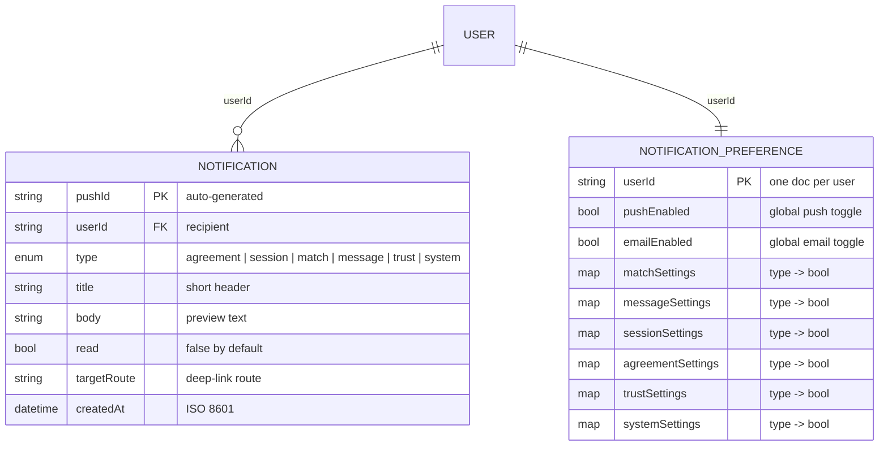

### Enums

| Field | Values |
|-------|--------|
| `notification.type` | `agreement`, `session`, `match`, `message`, `trust`, `system` |

### Key Relationships

| FK Field | References | Type |
|----------|------------|------|
| `notification.userId` | `users/{uid}` | N:1 |
| `preference.userId` | `users/{uid}` | 1:1 |

### Usage Notes

- Notifications are stored under a `userId` partition for efficient queries (`orderByChild` by userId)
- `targetRoute` enables deep-linking: when tapped, navigates to the relevant screen
- `notificationPreferences` is a single document per user containing all toggle settings
- Each settings map (e.g. `sessionSettings`) stores sub-toggles like `reminder: true`, `changeAlert: false`
- Global toggles (`pushEnabled`, `emailEnabled`) act as kill-switches over the per-type settings

---

## Dispute & Safety Domain

**RTDB Paths**: `disputes/{pushId}`, `disputes/{pushId}/messages/{pushId}`, `reports/{pushId}`, `blockedUsers/{blockerId}/{blockedUserId}`

**Status**: ❌ Not yet implemented

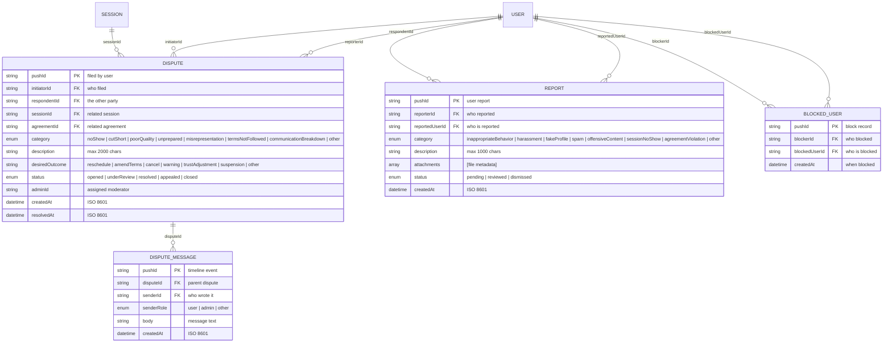

### Enums

| Entity | Field | Values |
|--------|-------|--------|
| `Dispute` | `category` | `noShow`, `cutShort`, `poorQuality`, `unprepared`, `misrepresentation`, `termsNotFollowed`, `communicationBreakdown`, `other` |
| `Dispute` | `status` | `opened`, `underReview`, `resolved`, `appealed`, `closed` |
| `DisputeMessage` | `senderRole` | `user`, `admin`, `other` |
| `Report` | `category` | `inappropriateBehavior`, `harassment`, `fakeProfile`, `spam`, `offensiveContent`, `sessionNoShow`, `agreementViolation`, `other` |
| `Report` | `status` | `pending`, `reviewed`, `dismissed` |

### Key Relationships

| FK Field | References | Type |
|----------|------------|------|
| `dispute.initiatorId` | `users/{uid}` | N:1 |
| `dispute.respondentId` | `users/{uid}` | N:1 |
| `dispute.sessionId` | `sessions/{pushId}` | N:1 |
| `disputeMessage.disputeId` | `disputes/{pushId}` | N:1 |
| `report.reportedUserId` | `users/{uid}` | N:1 |

### Usage Notes

- Disputes have a timeline of messages (including admin responses) stored as a sub-collection
- `desiredOutcome` is a free-text string from the user, not an enum (more flexible for edge cases)
- `adminId` is set when a moderator claims the dispute; null means unassigned
- `report.status` lifecycle: `pending` → `reviewed` | `dismissed`
- Blocked users are stored under a `blockerId` partition so the blocked list query is efficient: `blockedUsers/{blockerId}` ordered by child

---

## Progress Domain

**RTDB Paths**: `learningGoals/{pushId}`, `achievementUnlocks/{pushId}`, `activityEvents/{pushId}`

**Status**: ❌ Not yet implemented

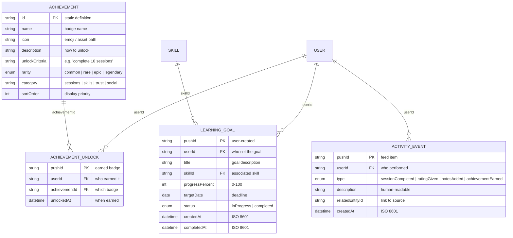

### Enums

| Field | Values |
|-------|--------|
| `goal.status` | `inProgress`, `completed` |
| `achievement.rarity` | `common`, `rare`, `epic`, `legendary` |
| `activityEvent.type` | `sessionCompleted`, `ratingGiven`, `notesAdded`, `achievementEarned` |

### Key Relationships

| FK Field | References | Type |
|----------|------------|------|
| `goal.userId` | `users/{uid}` | N:1 |
| `goal.skillId` | `skills/{pushId}` | N:1 |
| `unlock.userId` | `users/{uid}` | N:1 |
| `unlock.achievementId` | static definition | N:1 |
| `event.userId` | `users/{uid}` | N:1 |

### Usage Notes

- `Achievement` is a **static definition** — seeded at app init, not user-specific
- `AchievementUnlock` is the per-user record of which badges they've earned
- `ActivityEvent` powers the recent-activity feed on the progress dashboard
- `LearningGoal` progress is updated when sessions against the related skill are completed
- Goals turn from green (on track) → yellow (at risk) → red (overdue) based on `targetDate`

---

## Platform Rules Domain

**RTDB Paths**: `platformRules/{ruleId}`, `userAcknowledgment/{pushId}`

**Status**: ❌ Not yet implemented

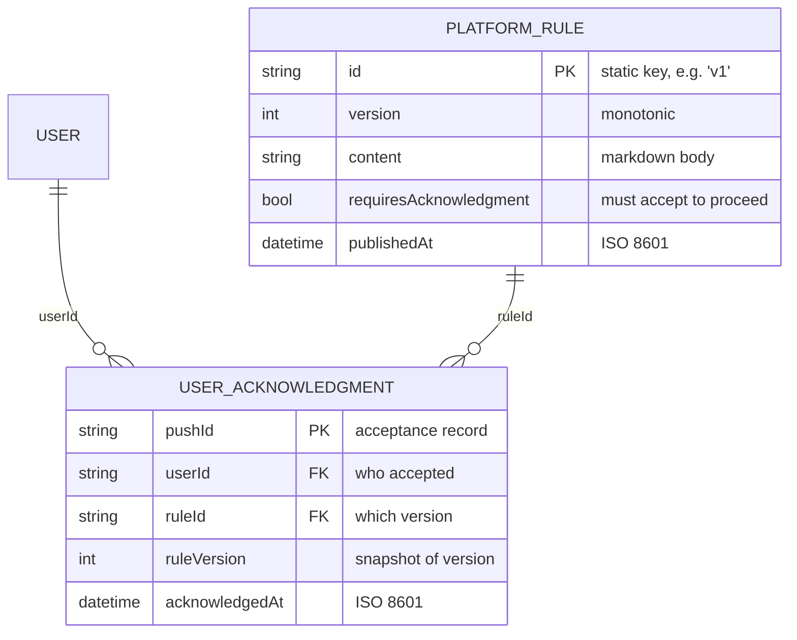

### Key Relationships

| FK Field | References | Type |
|----------|------------|------|
| `acknowledgment.userId` | `users/{uid}` | N:1 |
| `acknowledgment.ruleId` | `platformRules/{id}` | N:1 |

### Usage Notes

- When rules are updated, existing users must re-acknowledge before using the app
- `ruleVersion` is snapshotted on the acknowledgment so we know which version they agreed to

---

## Admin Domain — Additions

**Status**: ❌ Not yet implemented

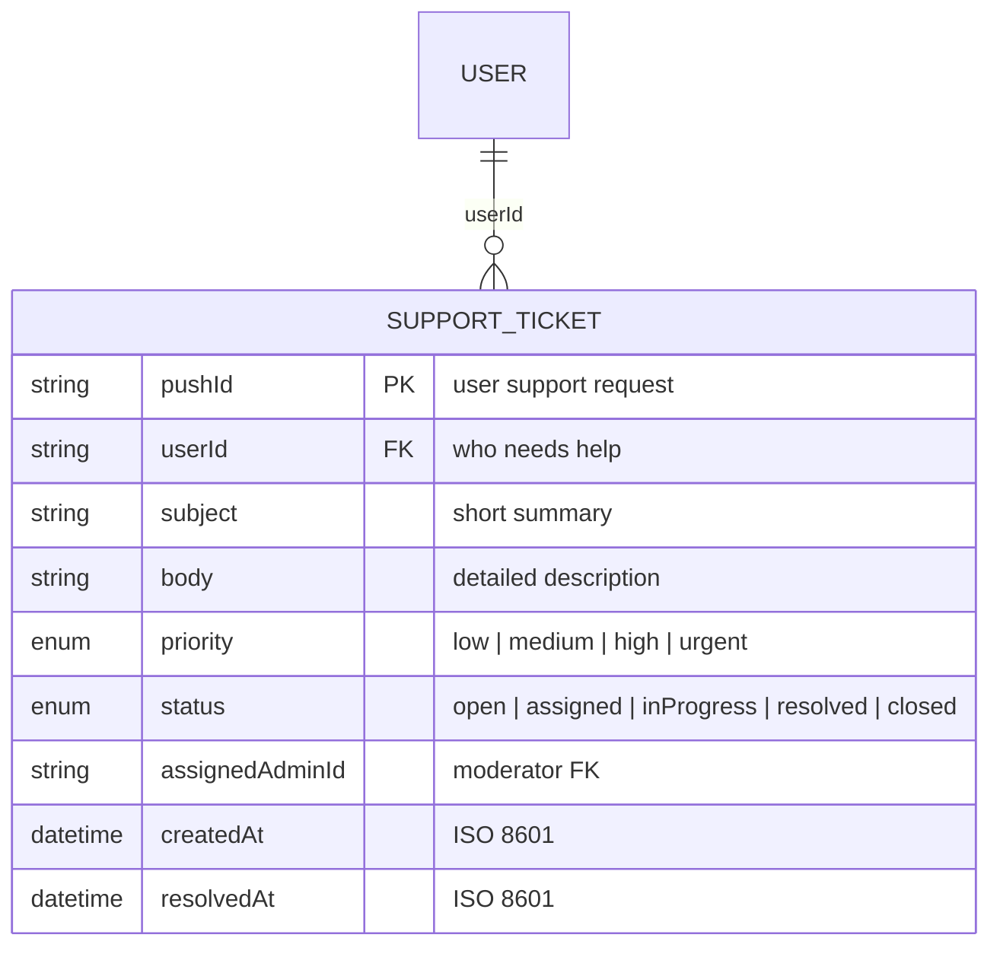

### Enums

| Field | Values |
|-------|--------|
| `priority` | `low`, `medium`, `high`, `urgent` |
| `status` | `open`, `assigned`, `inProgress`, `resolved`, `closed` |

### Key Relationships

| FK Field | References | Type |
|----------|------------|------|
| `supportTicket.userId` | `users/{uid}` | N:1 |

---

## Admin Domain — Existing (Mock Only)

**Storage**: Currently served from `AdminRemoteDataSourceMock`. Ready for future RTDB persistence.

```mermaid
erDiagram
    ADMIN_USER {
        string id PK
        string firstName
        string lastName
        string email
        string role
        string status
        string joined
        int sessions
        double rating
        int reportsCount
        bool twoFactorEnabled
    }

    FLAGGED_CONTENT {
        string id PK
        string priority "HIGH | MED | LOW"
        string reason
        string preview
        string reportedBy
        string fromUser
        string timestamp
        string type "Message | Review | Profile | Skills"
        string status "Pending | Dismissed | Removed"
        string contentId "optional reference"
    }

    PENALTY {
        string id PK
        string severity "Low | Medium | High"
        string type "Permanent Ban | Suspension | Warning | Trust Score Reduction | Content Removal"
        string user "denormalized name *"
        string userId FK
        string reason
        string date
        string duration
        int strikes
        bool isActive
    }

    ANALYTICS_DATA {
        int newUsers
        int totalMatches
        int sessionsCompleted
        double avgRating
        double avgTrustScore
        double disputeRate
        array userGrowth "28 data points"
        map matchSuccessByCategory "category -> rate"
        double sessionCompletionRate
        double sessionCancelRate
        double sessionNoShowRate
        double sessionRescheduleRate
    }

    SYSTEM_CONFIG {
        map featureFlags "name -> bool"
        map matchParams "name -> double"
        map trustThresholds "name -> int"
        map generalSettings "name -> int"
    }

    SKILL_CATEGORY {
        string id PK
        string name
        string emoji
        int skillCount
        bool active
        int displayOrder
        array subcategories
    }

    BROADCAST {
        string id PK
        string title
        string message
        string audience
        int recipientCount
        string sentDate
        double openRate
        bool isScheduled
        datetime scheduledAt
        string status
    }

    AUDIT_LOG {
        string id PK
        string time
        string admin
        string action
        string detail
        string severity "critical | warning | info"
        string ip
        string device
        string changes
        datetime timestamp
    }

    ADMIN_ROLE {
        string id PK
        string name
        int members
        int permissionCount
        int totalPermissions
        bool isProtected
        map permissions "category -> permission list"
    }

    DATABASE_STATS {
        int totalDocuments
        int totalCollections
        string storageUsed
        string lastBackup
        array collections
    }

    COLLECTION_INFO {
        string name PK
        int documents
        string size
        string status
    }

    ADMIN_DASHBOARD {
        int totalUsers
        int activeMatches
        int sessionsThisWeek
        double averageRating
    }

    USER ||--o{ PENALTY : "userId"
```

### Admin Enums

| Entity | Field | Values |
|--------|-------|--------|
| `FlaggedContent` | `priority` | `HIGH`, `MED`, `LOW` |
| `FlaggedContent` | `type` | `Message`, `Review`, `Profile`, `Skills` |
| `FlaggedContent` | `status` | `Pending`, `Dismissed`, `Removed` |
| `Penalty` | `severity` | `Low`, `Medium`, `High` |
| `AuditLog` | `severity` | `critical`, `warning`, `info` |

---

## Cross-Domain Reference Map

| Entity | RTDB Path | Domain | Status |
|--------|-----------|--------|--------|
| `User` | `users/{uid}` | Auth | ✅ Implemented |
| `Skill` | `skills/{pushId}` | Skills | ✅ Implemented |
| `SavedSearch` | `savedSearches/{pushId}` | Skills | ✅ Implemented |
| `Match` | `matches/{compositeId}` | Matchmaking | ✅ Implemented |
| `ChatThread` | `chats/{pushId}` | Communication | ❌ Missing |
| `Message` | `chats/{pushId}/messages/{pushId}` | Communication | ❌ Missing |
| `Agreement` | `agreements/{pushId}` | Agreement | ❌ Missing |
| `Session` | `sessions/{pushId}` | Session | ❌ Missing |
| `CheckIn` | `sessions/{pushId}/checkIns/{pushId}` | Session | ❌ Missing |
| `SessionMaterial` | `sessions/{pushId}/materials/{pushId}` | Session | ❌ Missing |
| `SessionNote` | `sessions/{pushId}/notes/{pushId}` | Session | ❌ Missing |
| `Review` | `reviews/{pushId}` | Trust | ❌ Missing |
| `TrustAppeal` | `trustAppeals/{pushId}` | Trust | ❌ Missing |
| `Notification` | `notifications/{userId}/{pushId}` | Notification | ❌ Missing |
| `NotificationPreference` | `notificationPreferences/{userId}` | Notification | ❌ Missing |
| `Dispute` | `disputes/{pushId}` | Dispute | ❌ Missing |
| `DisputeMessage` | `disputes/{pushId}/messages/{pushId}` | Dispute | ❌ Missing |
| `Report` | `reports/{pushId}` | Safety | ❌ Missing |
| `BlockedUser` | `blockedUsers/{pushId}` | Safety | ❌ Missing |
| `LearningGoal` | `learningGoals/{pushId}` | Progress | ❌ Missing |
| `Achievement` | static definition | Progress | ❌ Missing |
| `AchievementUnlock` | `achievementUnlocks/{pushId}` | Progress | ❌ Missing |
| `ActivityEvent` | `activityEvents/{pushId}` | Progress | ❌ Missing |
| `SkillProgress` | `skillProgress/{pushId}` | Progress | ❌ Missing |
| `PlatformRule` | `platformRules/{id}` | Platform Rules | ❌ Missing |
| `UserAcknowledgment` | `userAcknowledgment/{pushId}` | Platform Rules | ❌ Missing |
| `SupportTicket` | `supportTickets/{pushId}` | Admin | ❌ Missing |
| `AdminUser` | — | Admin | ⚠️ Mock only |
| `FlaggedContent` | — | Admin | ⚠️ Mock only |
| `Penalty` | — | Admin | ⚠️ Mock only |
| `AnalyticsData` | — | Admin | ⚠️ Mock only |
| `SystemConfig` | — | Admin | ⚠️ Mock only |
| `SkillCategory` | — | Admin | ⚠️ Mock only |
| `Broadcast` | — | Admin | ⚠️ Mock only |
| `AuditLog` | — | Admin | ⚠️ Mock only |
| `AdminRole` | — | Admin | ⚠️ Mock only |
| `DatabaseStats` | — | Admin | ⚠️ Mock only |

---

## Implementation Priority Matrix

| Priority | Domain | Entities | Depends On | Use Cases |
|----------|--------|----------|------------|-----------|
| P0 | Auth | `User`, `Location` | — | F01-F16 |
| P1 | Skills | `Skill`, `SavedSearch` | User | S01-S14 |
| P2 | Matchmaking | `Match` | User, Skill | M01-M14 |
| **P3** | **Communication** | `ChatThread`, `Message` | Match | C01-C08 |
| **P3** | **Agreement** | `Agreement` | User, Skill, Match | C09-C13 |
| **P4** | **Session** | `Session`, `CheckIn`, `Material`, `Note`, `SkillProgress` | Agreement | E01-E15 |
| **P5** | **Trust** | `Review`, `TrustAppeal` | Session | T01-T10 |
| **P5** | **Notification** | `Notification`, `Preference` | All | X01-X04 |
| **P5** | **Dispute** | `Dispute`, `DisputeMessage`, `Report` | Session, Agreement | X05-X08 |
| **P5** | **Progress** | `LearningGoal`, `Achievement`, `ActivityEvent` | Session, Skill | X09-X12 |
| **P5** | **Safety** | `BlockedUser` | User | X15-X16 |
| **P5** | **Platform Rules** | `PlatformRule`, `UserAcknowledgment` | User | X13-X14 |
| Admin | Admin | All admin entities | User | A01-A26 |

---

## Data Flow Patterns

### Read Path (Login Example)
```
Firebase Auth (signIn) 
  → AuthRemoteDataSourceFirebase.login()
  → _getUserFromDatabase(uid)
  → RTDB: users/{uid}
  → Map<String, dynamic>.from(snapshot.value as Map)
  → UserModel.fromJson()
  → UserEntity
```

### Write Path (Seed Example)
```
SeederService.run()
  → Firebase Auth: createUserWithEmailAndPassword()
  → RTDB: users/{uid}.set(profileJson)
  → RTDB: skills/{pushId}.set(skillJson)
  → RTDB: matches/{id}.set(matchJson)
```

### Denormalization Strategy
- Match records copy user/skill display fields at creation time — avoids N+1 reads on match listings
- Chat threads store `lastMessagePreview`/`timestamp` for zero-query list rendering
- Sessions store `skillName` so the calendar and history screens don't need a join
- Trade-off: stale data if source profile changes after denormalization; acceptable because these are immutable snapshots
