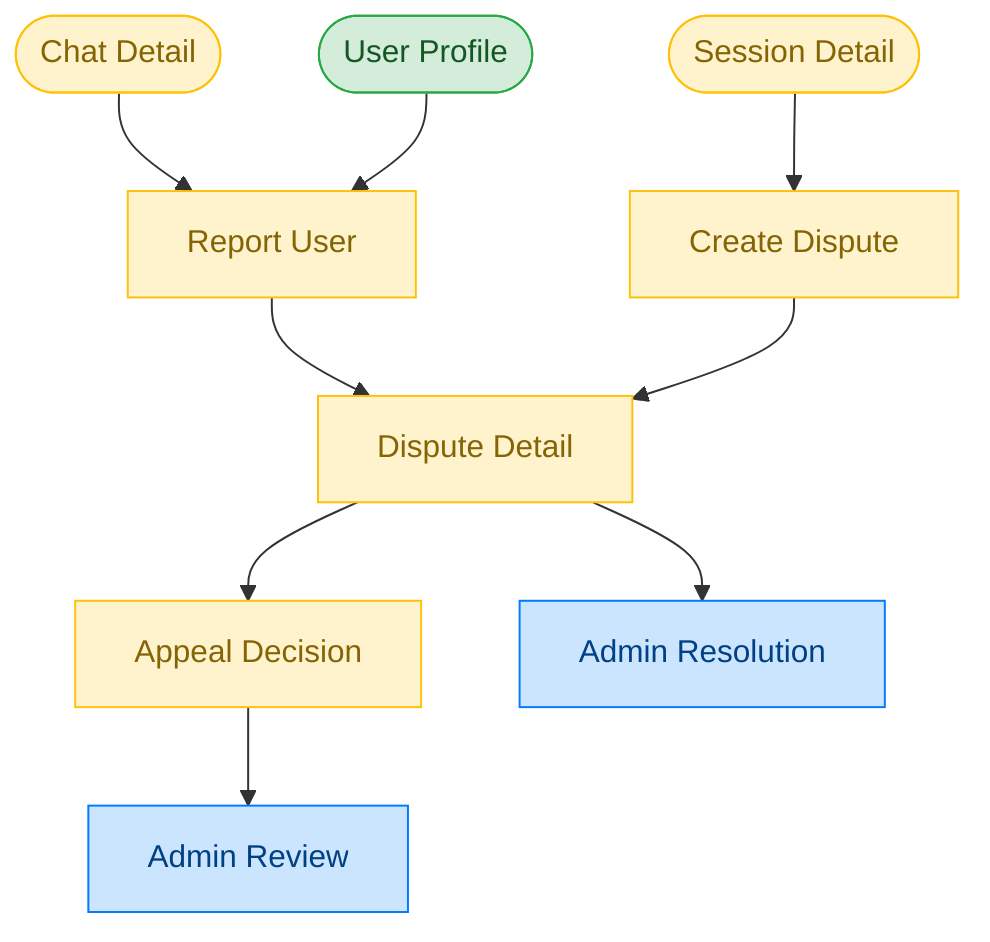

# Dispute & Safety Flow

**Feature**: Dispute & Safety
**Screens**: 3 (0 existing + 3 pending)
**Status**: Planned

## Diagram

## Flow Description
Users can report others from chat or their profile, or create formal disputes related to sessions/agreements. Each report/dispute is tracked with a status and can be escalated for admin review. Users can appeal dispute decisions if they disagree with the resolution.

## Screen Inventory

| Screen | Route | Status | Use Cases |
|--------|-------|--------|-----------|
| Report User | `/report/:userId` | ❌ Todo | X05 |
| Create Dispute | `/disputes/create` | ❌ Todo | X06 |
| Dispute Detail | `/disputes/:id` | ❌ Todo | X07, X08 |

## Notes
- Evidence attachment (screenshots, messages) needed for reports
- Admin-mediated resolution with status tracking
- Appeal window should have a time limit
