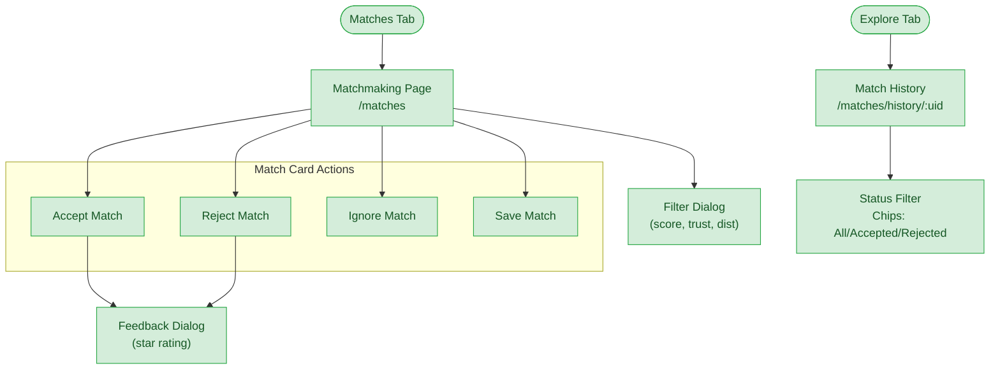

# Matchmaking Flow

**Feature**: Matching Engine, Match Interaction, Match Optimization
**Screens**: 2 (2 existing + 0 pending)
**Status**: Complete

## Diagram

## Flow Description
The Matchmaking Page displays daily match suggestions as cards. Each card shows the target skill, match score, distance, and verification status. Users can accept, reject, or ignore matches. Accepting or rejecting triggers a feedback dialog for rating match quality. The filter dialog allows narrowing by minimum score, trust score, maximum distance, and verified-only. Match History shows past interactions with status filter chips.

## Screen Inventory

| Screen | Route | Status | Use Cases |
|--------|-------|--------|-----------|
| Matchmaking Page | `/matches` | ✅ Existing | M01-M11, M13-M14 |
| Match History | `/matches/history/:uid` | ✅ Existing | M12 |

## Notes
- Match scoring algorithm: category (30pts) + level (25pts) + format (20pts) + tags (15pts) + geo (10pts) + availability (5pts) = max 100pts
- Geo-proximity uses Haversine formula from `lib/core/utils/geo_utils.dart`
- After accept/reject → feedback dialog → currently only rating, no comment field used
