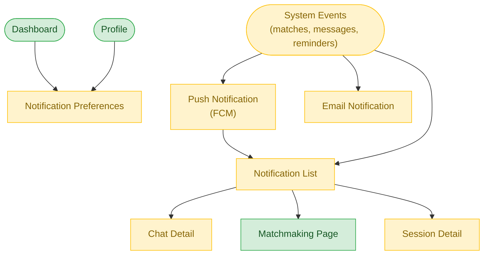

# Notification Flow

**Feature**: Cross-Cutting Notification System
**Screens**: 2 (0 existing + 2 pending)
**Status**: Planned

## Diagram

## Flow Description
System events (new matches, messages, session reminders, agreement updates) trigger notifications delivered via push (FCM) and email. Users can view their full notification history and configure preferences per notification type. Tapping a notification navigates to the relevant screen.

## Screen Inventory

| Screen | Route | Status | Use Cases |
|--------|-------|--------|-----------|
| Notification List | `/notifications` | ❌ Todo | X04 |
| Notification Preferences | `/notifications/preferences` | ❌ Todo | X03 |

## Notes
- Multi-channel delivery: push (FCM), email, and in-app
- Notification badges on bottom nav tabs
- Group similar notifications (e.g., "3 new matches")
