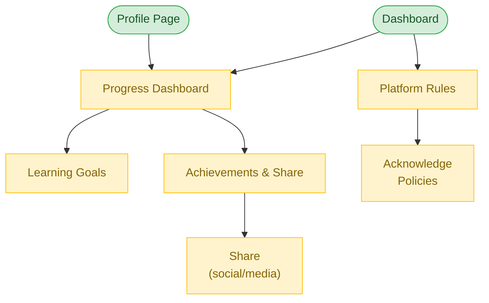

# Progress Tracking & Platform Rules Flow

**Feature**: Progress Tracking, Platform Rules
**Screens**: 4 (0 existing + 4 pending)
**Status**: Planned

## Diagram

## Flow Description
Users can track their learning progress through a visual dashboard showing completed sessions, skills learned, and milestones. Learning goals allow setting personal targets. Achievements are earned and can be shared socially. Platform rules and policies are accessible from the dashboard and require acknowledgment when updated.

## Screen Inventory

| Screen | Route | Status | Use Cases |
|--------|-------|--------|-----------|
| Progress Dashboard | `/progress` | ❌ Todo | X09, X10 |
| Learning Goals | `/goals` | ❌ Todo | X11 |
| Achievements | `/achievements` | ❌ Todo | X12 |
| Platform Rules | `/rules` | ❌ Todo | X13, X14 |

## Notes
- Progress metrics: sessions completed, skills learned/taught, hours exchanged
- Achievement badges for milestones (first session, 10 sessions, 5 skills, etc.)
- Social sharing generates a shareable card/image
