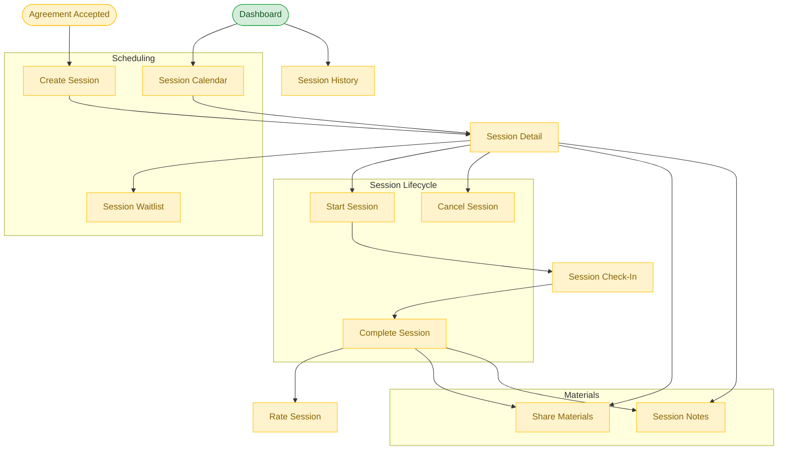

# Session Execution Flow

**Feature**: Scheduling, Session Lifecycle, Session Materials
**Screens**: 7 (0 existing + 7 pending)
**Status**: Planned

## Diagram

## Flow Description
After an agreement is accepted, sessions can be scheduled with time, location, and format. Sessions appear on a calendar view. The session lifecycle: Scheduled → Started (check-in) → Completed (with optional verification). After completion, both parties can rate the session and share materials or collaborative notes.

## Screen Inventory

| Screen | Route | Status | Use Cases |
|--------|-------|--------|-----------|
| Create Session | `/sessions/create` | ❌ Todo | E01, E06 |
| Session Detail | `/sessions/:id` | ❌ Todo | E02, E03, E08, E09 |
| Session Calendar | `/sessions/calendar` | ❌ Todo | E05, E07 |
| Session Check-In | `/sessions/:id/checkin` | ❌ Todo | E10, E11 |
| Session History | `/sessions/history` | ❌ Todo | E12 |
| Share Materials | `/sessions/:id/materials` | ❌ Todo | E14 |
| Session Notes | `/sessions/:id/notes` | ❌ Todo | E15 |

## Notes
- Reminders (E04) handled via push notifications, not a dedicated page
- Calendar integration (E05) uses device calendar APIs
- QR code / geolocation for attendance verification (E10, E11)
