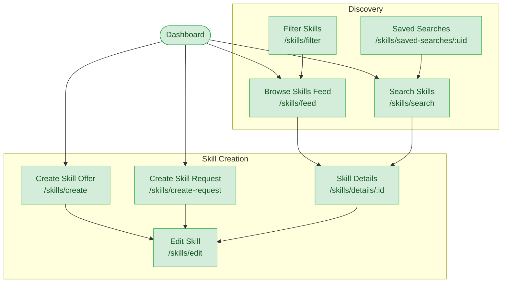

# Skills Ecosystem Flow

**Feature**: Skill Creation & Management, Discovery System, Skill Validation
**Screens**: 7 (7 existing + 0 pending)
**Status**: Complete

## Diagram

## Flow Description
Users can offer skills they want to teach or request skills they want to learn. Both flows use the same `CreateSkillOfferPage` differentiated by a `SkillType` parameter. The Browse Feed shows all available skills with cards; tapping one opens the details page. Search and Filter complement browsing. Skills can be edited, cloned, archived, or deleted from their details page. Saved searches allow users to quickly re-run specific queries.

## Screen Inventory

| Screen | Route | Status | Use Cases |
|--------|-------|--------|-----------|
| Create Skill Offer | `/skills/create` | ✅ Existing | S01 |
| Create Skill Request | `/skills/create-request` | ✅ Existing | S02 |
| Edit Skill | `/skills/edit` | ✅ Existing | S03 |
| Skill Details | `/skills/details/:id` | ✅ Existing | S11 |
| Browse Skills Feed | `/skills/feed` | ✅ Existing | S10 |
| Search Skills | `/skills/search` | ✅ Existing | S08 |
| Filter Skills | `/skills/filter` | ✅ Existing | S09 |
| Saved Searches | `/skills/saved-searches/:uid` | ✅ Existing | S12 |

## Notes
- Skill CRUD operations (S04 delete, S05 fetch, S06 clone, S07 archive) are handled via bloc/dialogs, not dedicated pages
- S13 (Suggest Category) and S14 (Verify Expertise) are AI/backend features without dedicated pages
- Feed cards and search results currently have commented-out `onTap` navigation to details
