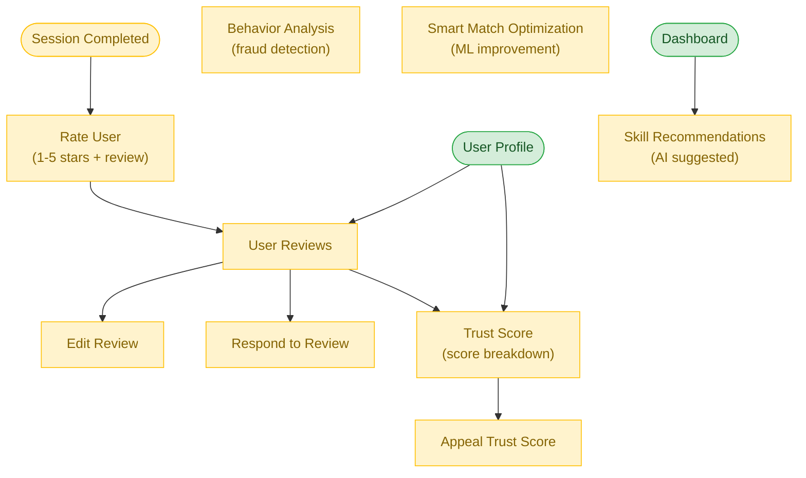

# Trust & AI Flow

**Feature**: Feedback System, Trust System, AI Enhancements
**Screens**: 5 (0 existing + 5 pending)
**Status**: Planned

## Diagram

## Flow Description
After each completed session, users rate each other (1-5 stars) with optional written reviews. Reviews are visible on user profiles. Users can edit their review within 48 hours and respond to received feedback. The Trust Score (0-100) is computed from all reviews and behavior, visible with a breakdown of contributing factors. Users can appeal trust score adjustments. AI features provide skill recommendations on the dashboard.

## Screen Inventory

| Screen | Route | Status | Use Cases |
|--------|-------|--------|-----------|
| Rate User | `/rate/:sessionId` | ❌ Todo | T01, T02 |
| User Reviews | `/profile/:uid/reviews` | ❌ Todo | T03 |
| Edit Review | `/reviews/:id/edit` | ❌ Todo | T04 |
| Trust Score | `/trust-score` | ❌ Todo | T06-T09 |
| Appeal Trust Score | `/trust-score/appeal` | ❌ Todo | T10 |

## Notes
- Trust score is AI-computed (0-100) based on completed sessions, ratings, behavior
- AI recommendations displayed on the dashboard Explore tab
- Fraud detection runs in the background, no dedicated page
