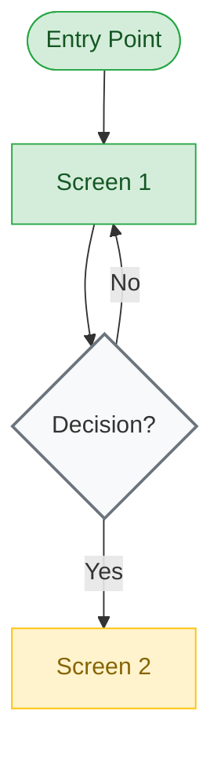

# [Flow Name] Flow

**Feature**: [Feature Module]
**Screens**: [count] ([done] existing + [pending] pending)
**Status**: [Complete | Partial | Planned]

## Diagram

## Flow Description
[Narrative description of the flow]

## Screen Inventory

| Screen | Route | Status | Use Cases |
|--------|-------|--------|-----------|
| [Screen 1] | `/path` | ✅ Done | [IDs] |
| [Screen 2] | `/path` | ❌ Todo | [IDs] |

## Notes
[Edge cases, error flows, auth requirements]
