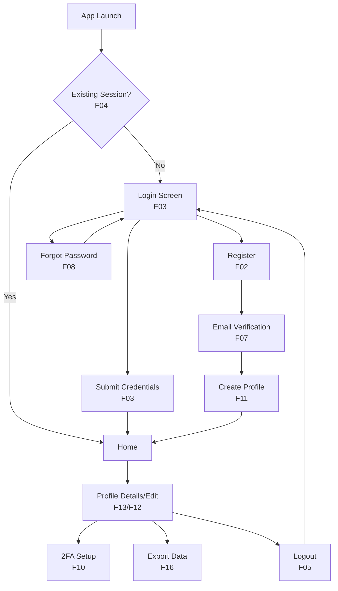
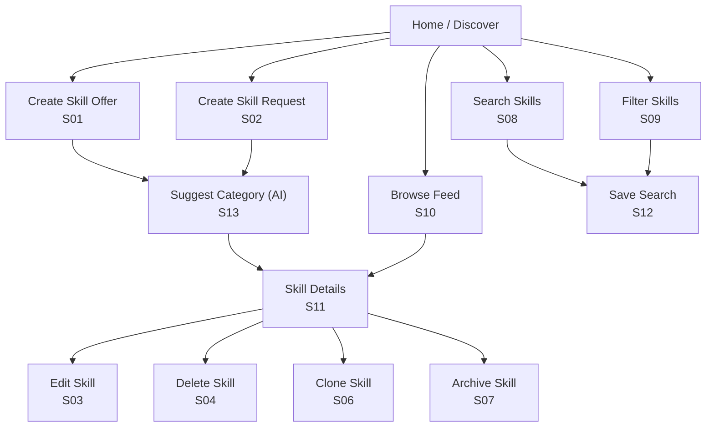
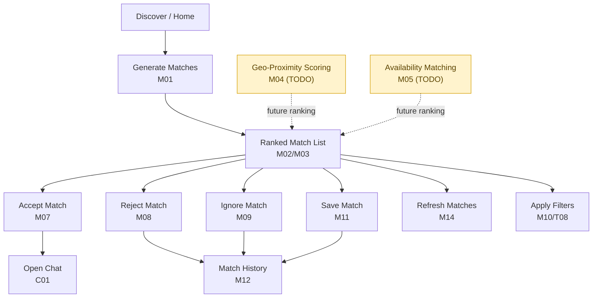
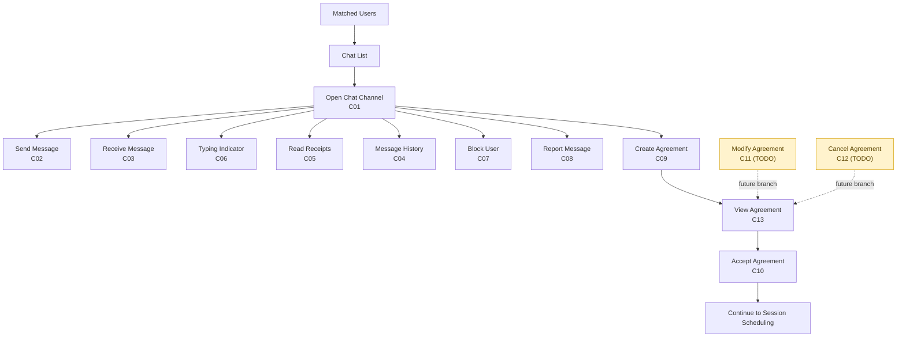
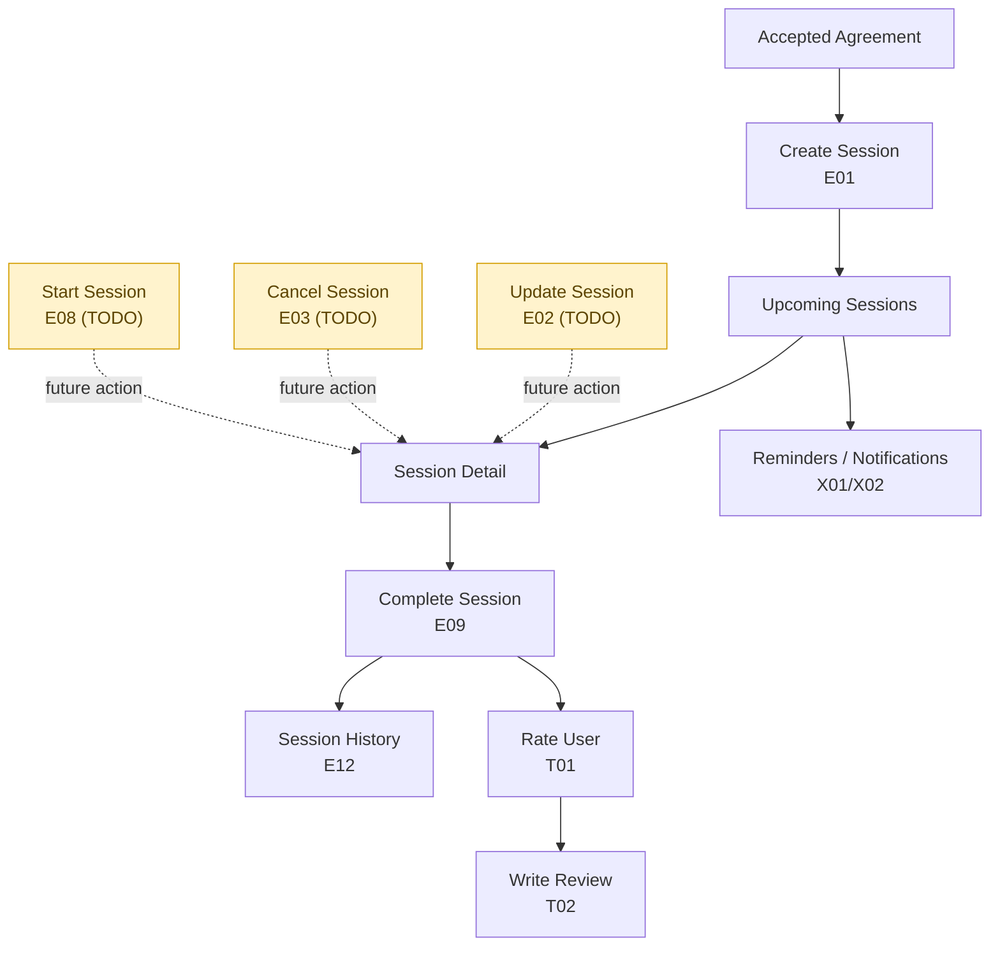
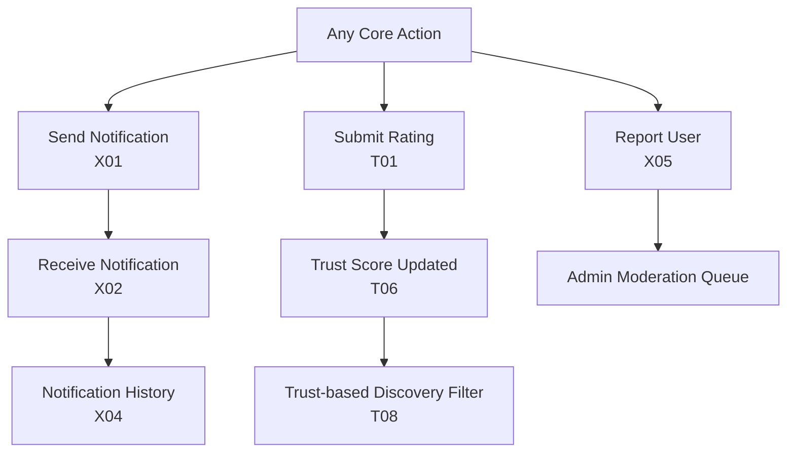
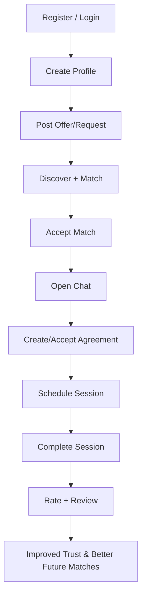

# Aptitude UI Flow Diagrams (from `use_case_tracker`)

This document maps tracked use cases to practical UI navigation paths using Mermaid charts.

## 1) Authentication & Onboarding (P0)

## 2) Skill Creation, Discovery & Management (P1)

## 3) Matchmaking Journey (P2)

## 4) Communication & Agreement (P3)

## 5) Session Execution (P4)

## 6) Trust, Safety & Notifications (P5 + Cross-cutting)

## 7) End-to-End Primary User Journey

## Notes
- Node labels include use-case IDs from `docs/use_case_tracker.md`.
- Dashed links indicate planned TODO branches not yet implemented.
- These diagrams are intentionally screen-oriented for design/review workflows.
